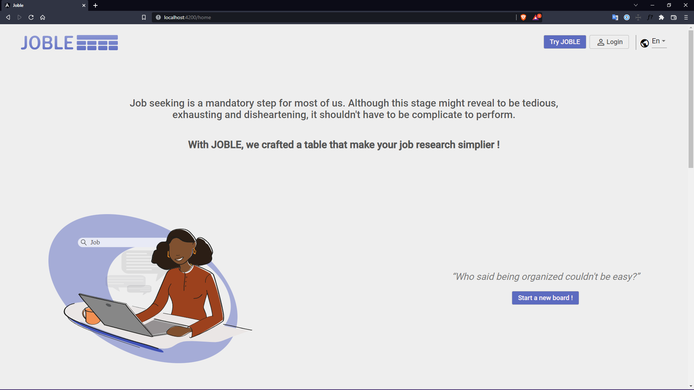
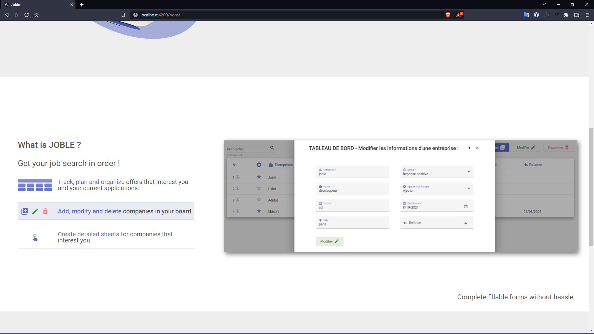
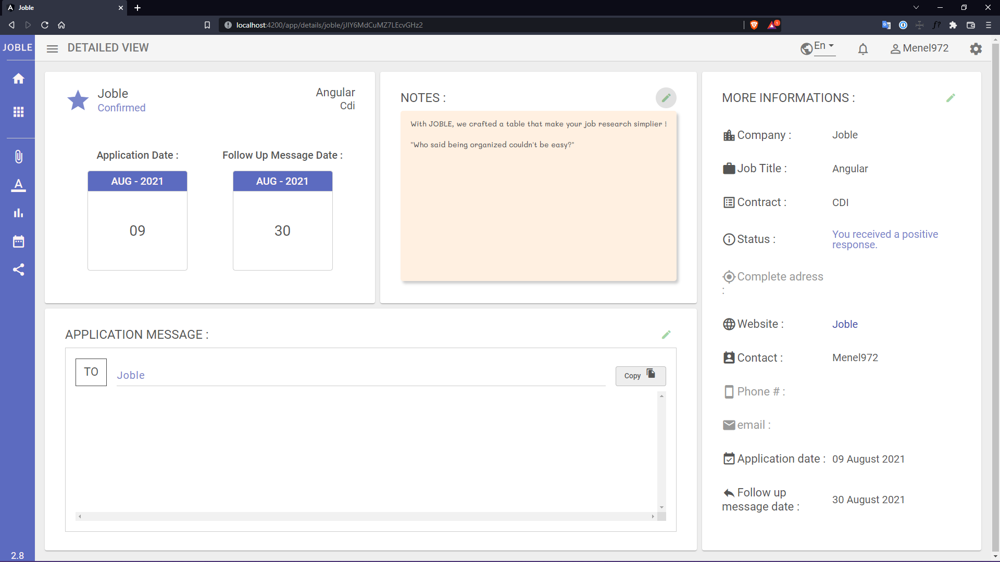

# About JOBLE website

I made this tool with Angular and Firebase to to make job researches simplier !

You can easily <strong>add, update and remove</strong> companies or offers and also <strong>track</strong> your applications.

  
  
  
  
  
  
  

  
  
  

## Getting Started

To get a local copy up and running follow these simple steps.

### Prerequisites

This project run with Angular 13.2.2 and rxjs 7.5.4

### Install
Clone this repo : https://github.com/menel972/Joble.git

run :

$ npm install

$ ng serve
